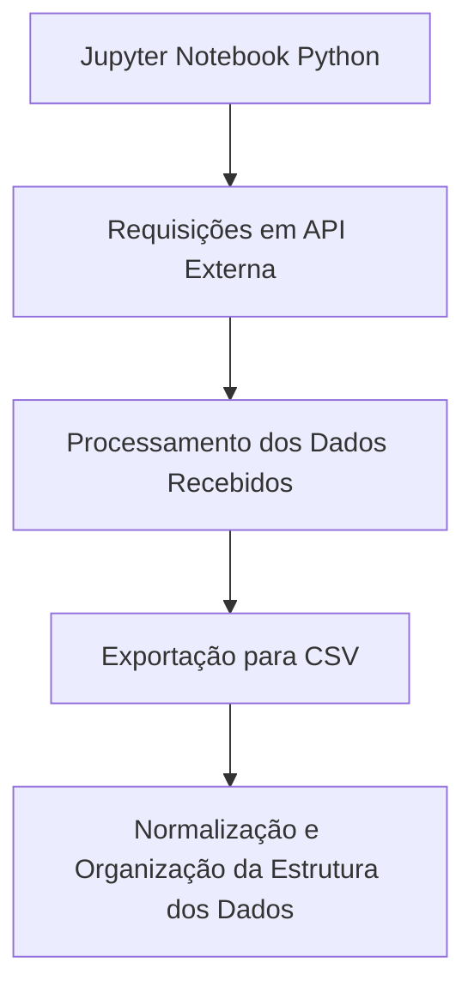

# meli-python
Desafio de Análise de Dados (Compliance &amp; Monitoring) - Mercado Livre

## Diagrama de Alto Nível da Solução



## Tecnologia

- ✅ Python
  
---

## Bibliotecas e Frameworks

- `flask`: Microframework web. Utilizado para simular a API.
- `threading`: Cria e controla threads (unidades de execução paralelas). Biblioteca utilizada para conseguir executar as requisições, da simulação da API, desenvolvida com a biblioteca flask. O código foi desenvolvido via Jupyter Notebook onde já se utiliza uma thread principal para executação do kernel. Portanto, ao executar as requisições, irá bloquear o processo atual impedindo que as outras células sejam executadas. Utilizando o threading, o servidor vai rodar em segundo plano, liberando o kernel do notebook para executar as células, evitando assim que o ambiente trave.
- `pandas`: Biblioteca utilizada para trabalhar com os dados de forma tabular.
- `random`: Biblioteca utilizada para gerar dados aleatórios para a criação da base de alertas.
- `datetime`: Biblioteca utilizada para trabalhar com dados de data e hora.
- `uuid`: Biblioteca utilizada para gerar identificadores únicos.
- `csv`: Biblioteca utilizada para escrever a base de alertas em um arquivo delimitado por vírgula (csv).
  
---

## Reprodução Projeto

### 1. Clone o repositório

```bash
git clone https://github.com/giovanna-butini/meli-python.git
cd meli-python
```

### 2. Execução do Código

Pode-se executar o notebook ou o código Python de forma interativa com:

```bash
jupyter notebook extract_compliance_data.ipynb
```

```bash
python extract_compliance_data.py
```

### 3. Especifique a Rota em seu Navegador ou Postman

**GET** `/api/alerts`

## Exemplo de Retorno
```json
    [
      {
        "alert_id": "007c228f-564f-4426-952a-a21dd0c3ea37",
        "assigned_to": "Logística",
        "conclusion": "Positivo",
        "creation_datetime": "2025-05-30 21:23:42",
        "impact_level": "Baixo",
        "resolutation_datetime": "2025-06-03 20:23:42",
        "status": "Concluído",
        "type_of_alert": "Produto sem rastreamento"
      },
      {
        "alert_id": "0083f937-9cb6-4ddd-b103-bda4aed2f70a",
        "assigned_to": "Monitoramento",
        "conclusion": "Falso positivo",
        "creation_datetime": "2025-06-04 02:23:42",
        "impact_level": "Médio",
        "resolutation_datetime": "2025-06-06 22:23:42",
        "status": "Concluído",
        "type_of_alert": "Login suspeito"
      }
    ]
```

**GET** `/api/alerts/<alert_id>`

| Parâmetro | Tipo     | Descrição                      | Obrigatório | 
|-----------|----------|--------------------------------|-------------|
| alert_id  | String   | Identificador único do alerta. | Sim         |

## Exemplo de Retorno
```json
    {
      "alert_id": "007c228f-564f-4426-952a-a21dd0c3ea37",
      "assigned_to": "Logística",
      "conclusion": "Positivo",
      "creation_datetime": "2025-05-30 21:23:42",
      "impact_level": "Baixo",
      "resolutation_datetime": "2025-06-03 20:23:42",
      "status": "Concluído",
      "type_of_alert": "Produto sem rastreamento"
    }
```

## Dicionário de Dados

| Campo                 | Tipo     | Descrição                                       | 
|:----------------------|:---------|:------------------------------------------------|
| alert_id              | String   | Identificador único do alerta.                  |
| creation_datetime     | Datetime | Data e hora em que o alerta foi gerado.         |
| impact_level          | String   | Nível de impacto para a organização/equipe.     |
| status                | String   | Status do alerta.                               |
| assigned_to           | String   | Time/equipe responsável.                        | 
| type_of_alert         | String   | Tipo do alerta.                                 |
| resolutation_datetime | Datetime | Data e hora da resolução/finalização do alerta. |
| conclusion            | String   | Conclusão da análise.                           |
---

## Possíveis Bloqueios e Mitigações

**1. Autenticação e Autorização**<br><br>
▸ **Problema:**
A API pode exigir algum método de autenticação.

▸ **Mitigação:**
1. Ler a documentação da API para entender o método de autenticação necessário.
2. Guardar tokens com segurança, utilizando variáveis de ambiente.

**2. Limite de Requisições**<br><br>
▸ **Problema:**
A API limitar a quantidade de requisições.

▸ **Mitigação:**
1. Utilizar sleep() entre chamadas.
2. Armazenar os dados em cache localmente.

**3. Problema de Processamento/Armazenamento**<br><br>
▸ **Problema:**
A API retornar dados grandes e complexos para serem tratados de uma só vez. 

▸ **Mitigação:**
1. Utilizar pipelines com ferramentas como Airflow ou Apache NiFi.
2. Trabalhar com lotes e processamento incremental.
